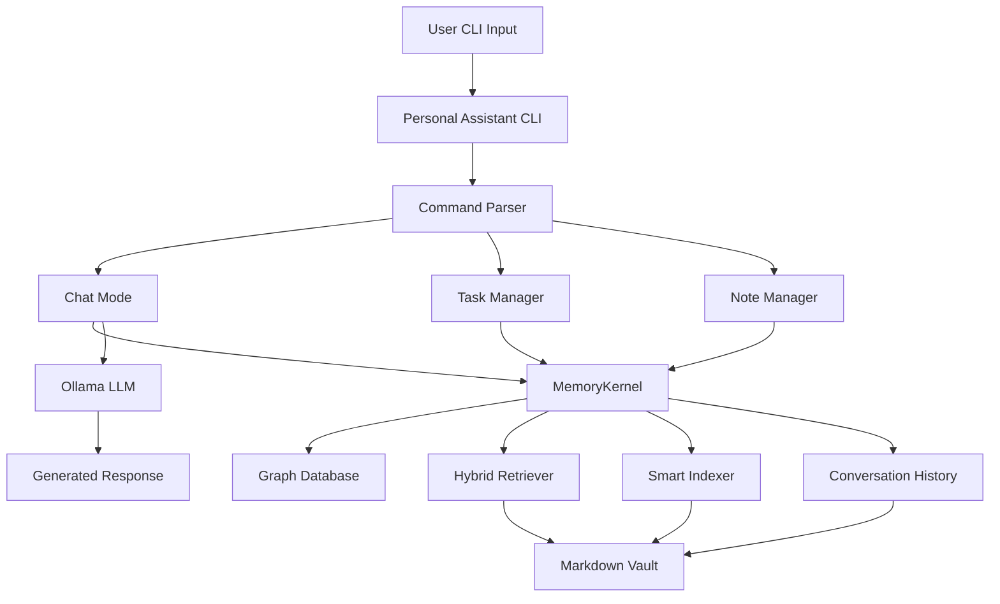

# Personal Assistant Project - Architecture & Planning

## Overview

A conversational CLI-based personal assistant built with **memograph** for memory management. This project serves as a comprehensive test bed for memograph's capabilities including conversation memory, task management, note-taking, and intelligent knowledge retrieval.

## Project Goals

1. **Test memograph functionality** - Validate all core features of the memograph package
2. **Demonstrate use cases** - Show practical applications of graph-based memory for LLMs
3. **Evaluate efficiency** - Measure performance of hybrid retrieval and context compression
4. **Showcase integration** - Demonstrate seamless integration with Ollama for local LLM usage

## Architecture

### System Components



### Directory Structure

```
PersonalAssistant/
├── README.md                    # Project documentation
├── setup.py                     # Package setup
├── pyproject.toml              # Modern Python project config
├── requirements.txt            # Dependencies
├── .env.example                # Environment variables template
├── config.yaml                 # Assistant configuration
├── assistant/
│   ├── __init__.py
│   ├── cli.py                  # Main CLI interface
│   ├── core.py                 # Core assistant logic
│   ├── commands.py             # Command handlers
│   ├── conversation.py         # Conversation management
│   ├── tasks.py                # Task management
│   └── notes.py                # Note-taking functionality
├── vault/                      # Memory vault directory
│   ├── conversations/          # Chat history
│   ├── tasks/                  # Task records
│   ├── notes/                  # User notes
│   └── knowledge/              # General knowledge base
├── examples/
│   ├── basic_chat.py          # Basic chat example
│   ├── task_workflow.py       # Task management demo
│   └── note_taking.py         # Note-taking demo
└── tests/
    ├── test_conversation.py   # Conversation tests
    ├── test_tasks.py          # Task management tests
    └── test_memory.py         # Memory retrieval tests
```

## Core Features

### 1. Interactive Chat Mode

**Purpose**: Conversational interface with context-aware responses using accumulated memory.

**Memograph Features Tested**:
- [`context_window()`](memograph/core/kernel.py) - Retrieve relevant context
- [`retrieve_nodes()`](memograph/core/kernel.py) - Graph traversal for related memories
- Hybrid retrieval combining keyword + graph + embeddings
- Token-aware context compression

**Implementation**:
- Chat loop with conversation history
- Each exchange stored as episodic memory
- Context retrieved from past conversations and knowledge base
- Cited sources in responses

**Commands**:
- `/chat` - Enter interactive chat mode
- `/history` - View conversation history
- `/clear` - Clear current session (memories persist)

### 2. Task Management

**Purpose**: Track todos, action items, and project tasks with automatic organization.

**Memograph Features Tested**:
- Smart Auto-Organization Engine for entity extraction
- Memory types (episodic for task creation events)
- Tag-based filtering and retrieval
- Salience scoring for prioritization

**Implementation**:
- Task CRUD operations
- Automatic deadline tracking
- Priority levels mapped to salience scores
- Smart entity extraction for assignees and projects

**Commands**:
- `/task add <description>` - Create new task
- `/task list [filter]` - List tasks with optional filter
- `/task complete <id>` - Mark task as complete
- `/task priority <id> <level>` - Set task priority

### 3. Note Taking

**Purpose**: Quick capture and structured note creation with automatic linking.

**Memograph Features Tested**:
- Wikilink and backlink generation
- Multiple memory types (semantic, procedural, fact)
- YAML frontmatter parsing
- Graph relationships

**Implementation**:
- Quick notes for rapid capture
- Structured notes with templates
- Automatic wikilink detection
- Tag suggestions based on content

**Commands**:
- `/note quick <text>` - Quick note capture
- `/note new <title>` - Create structured note
- `/note search <query>` - Search notes
- `/note link <note1> <note2>` - Manual linking

### 4. Knowledge Retrieval

**Purpose**: Query accumulated knowledge with intelligent retrieval and cited sources.

**Memograph Features Tested**:
- BFS graph traversal
- Depth-based exploration
- Top-k ranking
- Source citation system

**Implementation**:
- Natural language queries
- Multiple retrieval strategies
- Source attribution
- Context highlighting

**Commands**:
- `/ask <question>` - Query knowledge base
- `/search <keywords>` - Keyword search
- `/related <topic>` - Find related memories
- `/sources` - View recent sources

## Testing Strategy

### Memograph Feature Validation

| Feature | Test Scenario | Success Criteria |
|---------|---------------|------------------|
| Graph Traversal | Ask about linked topics | Retrieves connected memories via wikilinks |
| Hybrid Retrieval | Query with multiple matches | Combines keyword, graph, and relevance |
| Context Compression | Long conversation history | Stays within token budget |
| Smart Indexing | Add many notes | Only re-indexes changed files |
| Memory Types | Different note types | Correctly categorizes and retrieves |
| Salience Scoring | High-priority tasks | Returns important items first |
| Auto-Organization | Complex meeting note | Extracts entities, topics, action items |
| CLI Integration | Use memograph commands | Seamless kernel integration |

### Performance Metrics

1. **Indexing Speed**
   - Time to ingest 100/500/1000 notes
   - Cache hit rate on re-indexing

2. **Retrieval Quality**
   - Relevance of top-k results
   - Graph traversal depth vs. quality tradeoff
   - Context compression accuracy

3. **Memory Usage**
   - Graph size vs. vault size
   - Cache memory footprint

4. **Response Time**
   - Query to context generation latency
   - End-to-end chat response time

## Technical Specifications

### Dependencies

```
memograph>=0.0.2      # Core memory system
ollama>=0.1.0         # Local LLM provider
pyyaml>=6.0           # Configuration
rich>=13.0            # Beautiful CLI output
prompt-toolkit>=3.0   # Enhanced input
click>=8.0            # CLI framework (alternative to argparse)
```

### Configuration

**config.yaml**:
```yaml
vault:
  path: ./vault
  auto_ingest: true
  backup_enabled: true

ollama:
  base_url: http://localhost:11434
  model: llama3.1:8b
  temperature: 0.7
  max_tokens: 1024

retrieval:
  default_depth: 2
  default_top_k: 8
  token_limit: 2048
  enable_embeddings: false

conversation:
  auto_save: true
  max_history: 50
  include_context: true
```

### Memory Schema

**Conversation Memory**:
```yaml
---
title: "Chat Session 2024-03-08"
memory_type: episodic
tags: [conversation, user-interaction]
salience: 0.7
created: 2024-03-08T10:30:00Z
session_id: abc123
---

User: How do I deploy with Docker?
Assistant: Based on your deployment notes [S1]...

[[deployment]] [[docker]]
```

**Task Memory**:
```yaml
---
title: "Deploy new feature to production"
memory_type: episodic
tags: [task, deployment, high-priority]
salience: 0.9
status: pending
priority: high
deadline: 2024-03-15
created: 2024-03-08T10:00:00Z
---

Need to deploy the authentication feature to production.
Depends on: [[database-migration]]
Assigned to: @team
```

**Note Memory**:
```yaml
---
title: "Docker Deployment Process"
memory_type: procedural
tags: [docker, deployment, tutorial]
salience: 0.8
created: 2024-03-05T14:00:00Z
---

## Steps

1. Build image: `docker build -t app .`
2. Test locally: `docker run -p 8000:8000 app`
3. Push to registry: `docker push registry/app`

Related: [[ci-cd-pipeline]] [[production-checklist]]
```

## Implementation Phases

### Phase 1: Core Setup
- Project structure and dependencies
- Basic CLI framework
- MemoryKernel integration
- Configuration system

### Phase 2: Chat Interface
- Interactive chat loop
- Conversation persistence
- Context retrieval integration
- Ollama LLM integration

### Phase 3: Task Management
- Task CRUD operations
- Status tracking
- Priority management
- Smart organization

### Phase 4: Note Taking
- Quick note capture
- Structured notes
- Wikilink support
- Search functionality

### Phase 5: Advanced Features
- Source citation
- Related memory suggestions
- Statistics and analytics
- Export capabilities

### Phase 6: Testing & Documentation
- Comprehensive test suite
- Performance benchmarks
- Usage examples
- Documentation

## Success Criteria

1. **Functional Completeness**
   - All commands work as specified
   - Memory persists correctly
   - Context retrieval is accurate
   - LLM responses are coherent

2. **Memograph Validation**
   - All core features exercised
   - Edge cases handled
   - Performance acceptable
   - Integration seamless

3. **User Experience**
   - Intuitive commands
   - Fast response times
   - Helpful error messages
   - Beautiful output

4. **Documentation Quality**
   - Clear setup instructions
   - Comprehensive examples
   - API documentation
   - Troubleshooting guide

## Next Steps

1. Review and approve this plan
2. Switch to Code mode for implementation
3. Create project structure
4. Implement features iteratively
5. Test and validate
6. Document findings

## Notes

- Uses Ollama for fully local operation (no API keys required)
- Vault stored in project directory for easy inspection
- All memories human-readable markdown files
- Can extend with embeddings later for enhanced retrieval
- Modular design allows testing individual features
- Rich CLI output for better user experience
